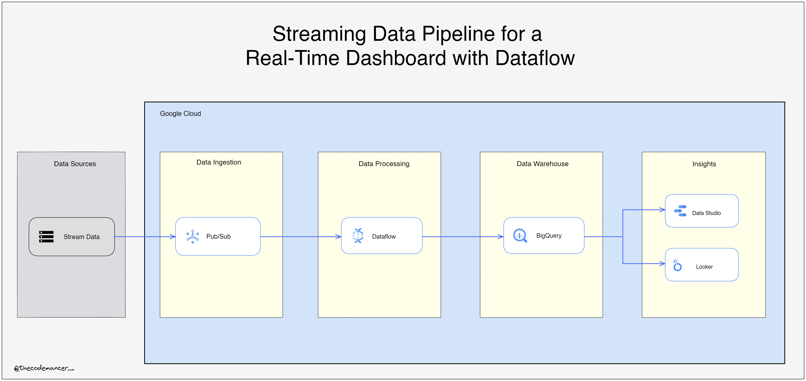

# Creating-a-Streaming-Data-Pipeline-for-a-Real-Time-Dashboard-with-Dataflow

You own a fleet of New York City taxi cabs and are looking to monitor how well your business is doing in real-time. You build a streaming data pipeline to capture taxi revenue, passenger count, ride status, and much more, and then visualize the results in a management dashboard.

## Overview
You own a fleet of New York City taxi cabs and are looking to monitor how well your business is doing in real-time. You build a streaming data pipeline to capture taxi revenue, passenger count, ride status, and much more, and then visualize the results in a management dashboard.

## Objectives

- Create a Dataflow job from a template
- Subscribe to a Pub/Sub topic
- Stream a Dataflow pipeline into BigQuery
- Monitor a Dataflow pipeline in BigQuery
- Analyze results with SQL
- Visualize key metrics in Looker Studio
